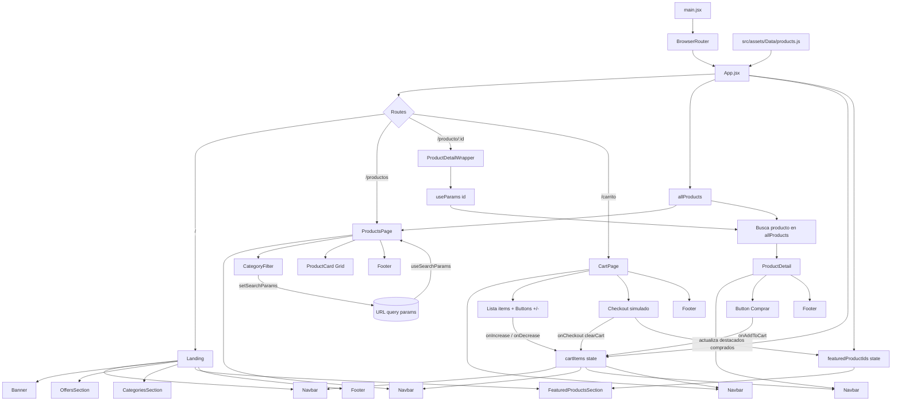

# Walkora 
### David pacanchique y  Sebastian villamil

Aplicación web de e-commerce de calzado construida con React y Vite.

El proyecto incluye:
- Landing con secciones destacadas y categorías.
- Catálogo de productos con filtros por URL.
- Vista de detalle de producto.
- Carrito con ajuste de cantidades y flujo de pago simulado.
- Despliegue en Vercel con soporte para rutas internas de React Router.

## 1. Stack tecnológico

- React 19
- React Router DOM 7
- Vite 8
- Tailwind CSS 4 (plugin oficial para Vite)
- Framer Motion
- React Icons
- Three.js (banner con render 3D)
- ESLint 10

## 2. Requisitos previos

- Node.js 18+ (recomendado 20+)
- npm 9+

## 3. Instalación y ejecución local

1. Instalar dependencias:

```bash
npm install
```

2. Ejecutar entorno de desarrollo:

```bash
npm run dev
```

3. Compilar para producción:

```bash
npm run build
```

4. Previsualizar build local:

```bash
npm run preview
```

5. Revisar lint:

```bash
npm run lint
```

## 4. Scripts disponibles

- `npm run dev`: inicia servidor de desarrollo Vite.
- `npm run build`: genera build de producción en `dist`.
- `npm run preview`: sirve el build de producción localmente.
- `npm run lint`: ejecuta ESLint en el proyecto.

## 5. Estructura del proyecto

```text
src/
	App.jsx
	main.jsx
	index.css
	assets/
		Data/
			products.js
		Img/
			Products/
	Components/
		ElementsUi/
			Button.jsx
			CategoryCard.jsx
			CategoryFilter.jsx
			ProductCard.jsx
			ProductDetail.jsx
		Pages/
			CartPage.jsx
			ProductsPage.jsx
		Sections/
			Banner.jsx
			CategoriesSection.jsx
			FeaturedProductsSection.jsx
			Footer.jsx
			Navbar.jsx
			OffersSection.jsx
```

## 6. Arquitectura funcional

### 6.1 Estado global en App

`App.jsx` centraliza el estado principal:
- `cartItems`: productos agregados al carrito con cantidad.
- `featuredProductIds`: ids de productos destacados de la semana.

Lógica principal:
- `addToCart`: agrega producto si no existe en carrito.
- `increaseItem` y `decreaseItem`: ajustan cantidad.
- `clearCart`: limpia carrito y actualiza destacados con lo comprado.
- `cartCount`: suma total de unidades para badge del carrito.

### 6.2 Routing

Rutas definidas con React Router:
- `/`: Landing.
- `/productos`: Catálogo con filtros.
- `/producto/:id`: Detalle por id.
- `/carrito`: Carrito de compras.

`main.jsx` envuelve la app en `BrowserRouter`.

## 7. Páginas y secciones

### 7.1 Landing (`/`)

Compuesta por:
- `Navbar`
- `Banner` (escena 3D con Three.js)
- `OffersSection` (productos con descuento en carrusel)
- `CategoriesSection` (atajos por género y tipo)
- `FeaturedProductsSection` (top 5 destacados)
- `Footer`

### 7.2 Catálogo (`/productos`)

`ProductsPage`:
- Lee filtros desde query params:
	- `genero`
	- `tipo`
	- `oferta`
- Mantiene URL sincronizada con filtros (`useSearchParams`).
- Filtra por:
	- género
	- tipo
	- presencia de oferta (`discountPrice < price`)
- Renderiza grid con `ProductCard`.

Ejemplos de URL:
- `/productos?genero=Hombre`
- `/productos?tipo=Deportivos`
- `/productos?oferta=Con%20oferta`

### 7.3 Detalle (`/producto/:id`)

`ProductDetail`:
- Obtiene producto por id desde `App`.
- Maneja imagen fallback si falla carga.
- Muestra precio normal o con descuento.
- Permite agregar al carrito.

### 7.4 Carrito (`/carrito`)

`CartPage`:
- Lista productos agregados con cantidad.
- Permite sumar/restar unidades.
- Calcula total con precio de oferta si aplica.
- Persiste el contenido del carrito en localStorage.
- Simula checkout por `alert/prompt/confirm`.
- Al aprobar pago llama `onCheckout` para vaciar carrito y actualizar destacados.

## 8. Componentes UI

### `Button`

Componente reutilizable con props:
- `size`: `large | medium | small`
- `state`: `enabled | pressed | disabled | text`
- `icon`: icono opcional
- `iconPosition`: `left | right | top | bottom`
- `onlyIcon`: modo solo icono

### `ProductCard`

- Tarjeta clickeable que navega al detalle.
- Soporta variante `normal` y `large`.
- Calcula y muestra porcentaje de descuento.

### `CategoryFilter`

- Filtros de catálogo:
	- género
	- tipo
	- oferta

### `CategoryCard`

- Tarjetas visuales para categorías con overlay y animación hover.

## 9. Datos y modelo de producto

Fuente actual: `src/assets/Data/products.js`.

Estructura de producto:

```js
{
	id: number,
	title: string,
	price: number,
	discountPrice: number | null,
	image: string,
	description: string,
	genero: "Hombre" | "Mujer" | "Unisex",
	tipo: "Deportivos" | "Formales" | "Verano" | "Trekking",
	isFeature: boolean
}
```

Notas:
- Si falta imagen, se usa fallback local.
- `isFeature` define prioridad para la sección de destacados.

## 10. Estilos y diseño

- Tailwind CSS 4 via `@tailwindcss/vite`.
- Tipografías cargadas desde Google Fonts en `index.html`:
	- Lemon (titulares)
	- Cuprum (texto general)
- En `src/index.css` se aplican fuentes por jerarquía semántica.

## 11. Configuración de calidad

- ESLint configurado en `eslint.config.js`.
- Reglas base de JavaScript + hooks de React + plugin de refresh para Vite.

## 12. Despliegue en Vercel

El proyecto ya incluye `vercel.json` con rewrite para SPA:

```json
{
	"rewrites": [
		{
			"source": "/(.*)",
			"destination": "/index.html"
		}
	]
}
```

Esto evita errores al refrescar rutas internas como:
- `/productos`
- `/producto/3`
- `/carrito`

Sin este rewrite, Vercel busca un archivo físico para la ruta y puede devolver errores de parseo o de recurso no encontrado.

## 13. Solución al error "Unexpected token 'export'"

Si en producción aparece el error:

```text
Uncaught SyntaxError: Unexpected token 'export'
```

Checklist recomendado:

1. Verificar que el despliegue use el build de Vite (`npm run build`).
2. Confirmar que existe `vercel.json` con rewrite a `index.html`.
3. En Vercel, limpiar caché y redeploy (opción "Redeploy with existing Build Cache" desactivada).
4. Confirmar que no haya rutas a archivos JS antiguos en caché del navegador (probar en incógnito).

## 14. Mejoras recomendadas

- Implementar búsqueda real en `Navbar` (actualmente visual, sin filtrado).
- Reemplazar flujo de pago simulado por integración real de pasarela.
- Extraer lógica de carrito a contexto (`React Context`) o estado global.
- Agregar pruebas unitarias y de integración.
- Normalizar textos y acentos en UI para consistencia.

## 15. Créditos

Proyecto académico de e-commerce de calzado, desarrollado con React, Vite y Tailwind CSS.

## 16. Diagrama de flujo de componentes


